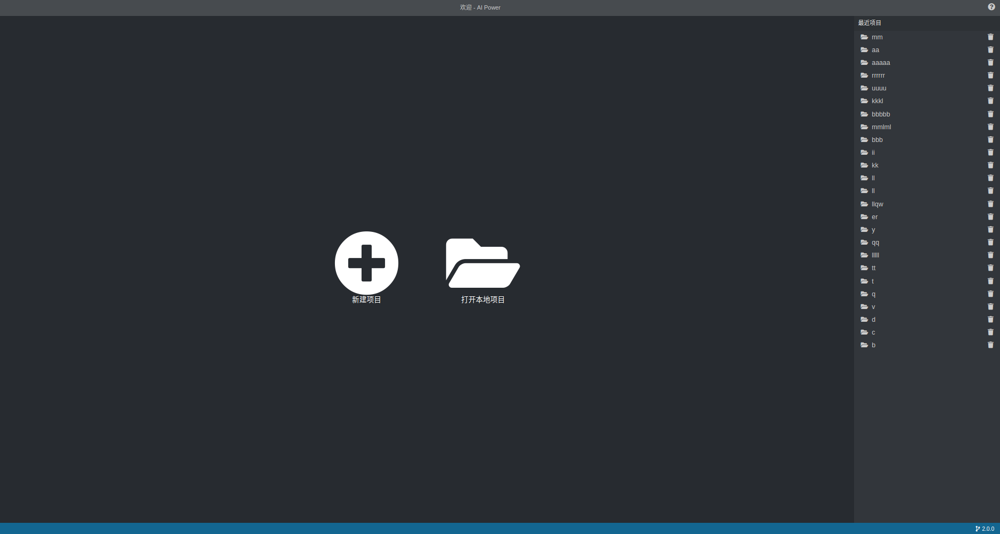
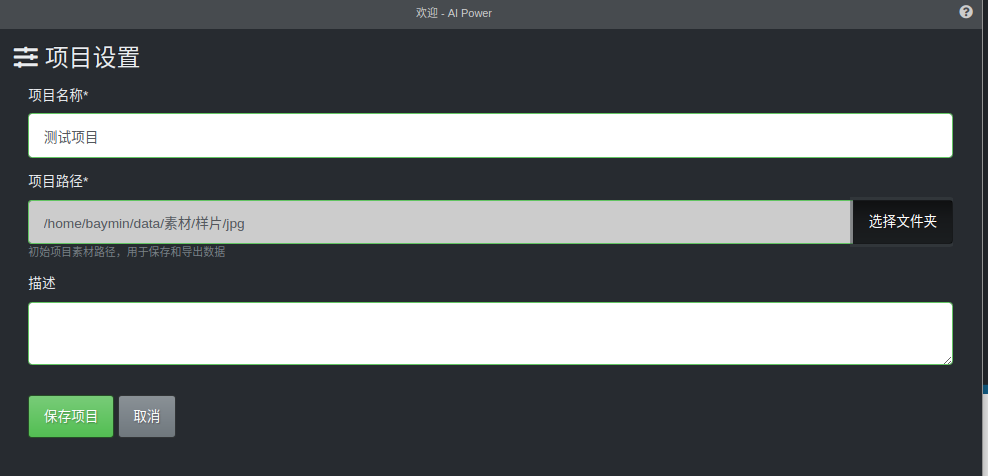
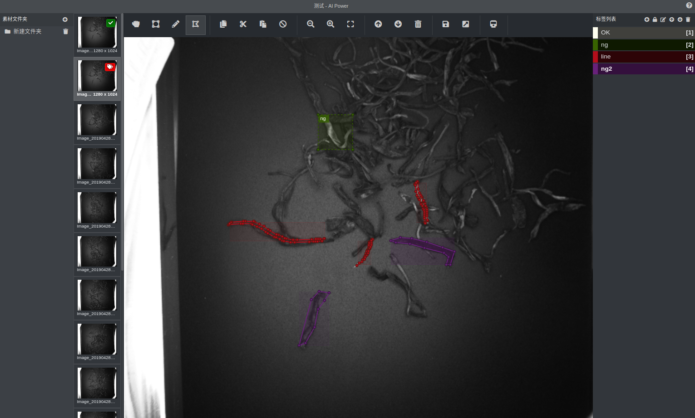
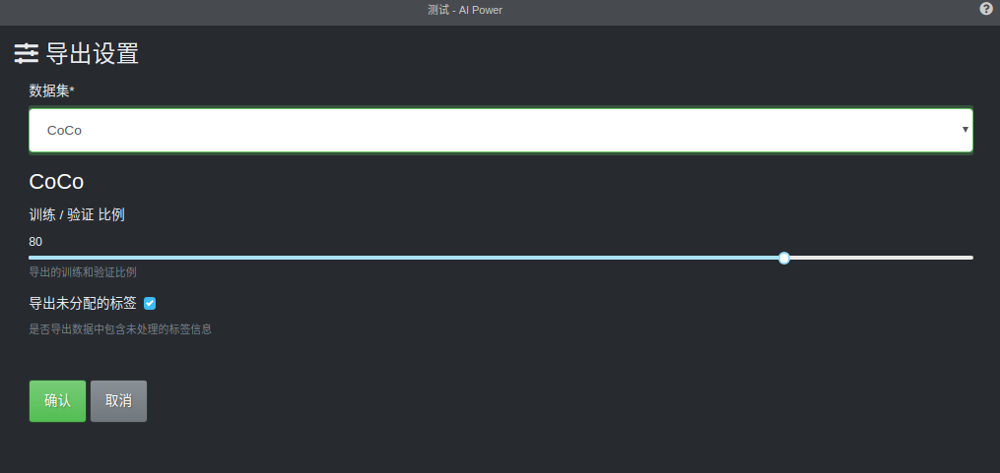
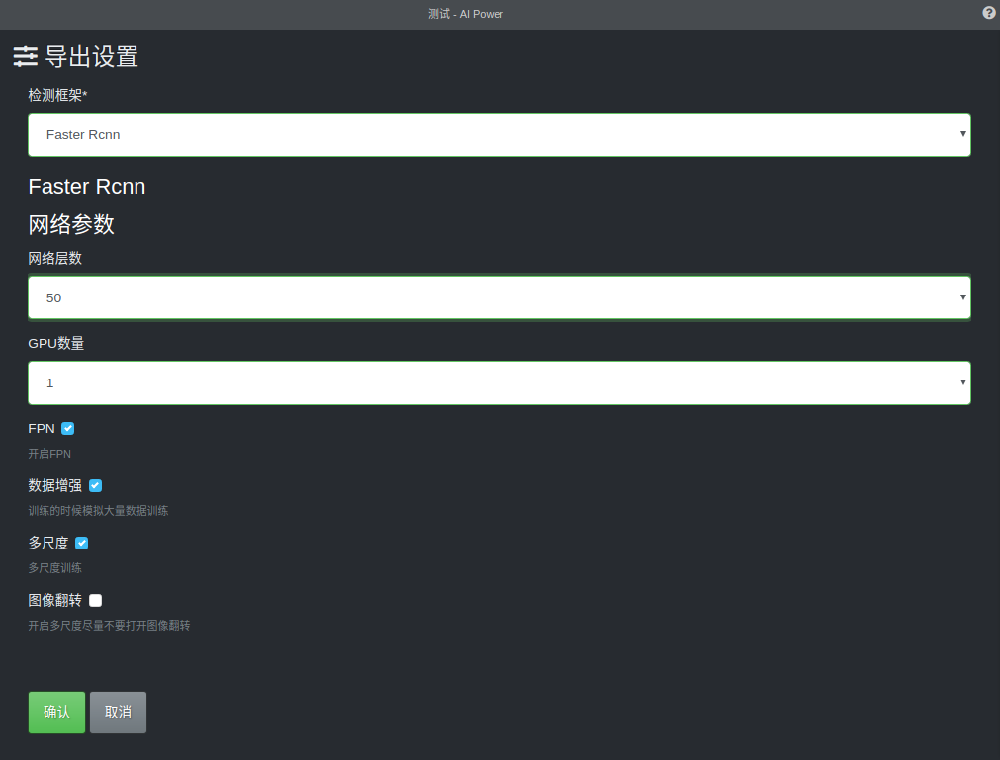
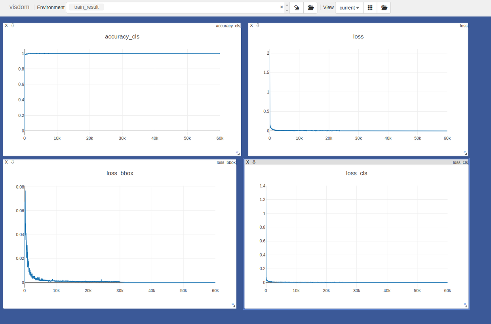

**1.1 软件概述**

Power AI视觉软件，是一套集数据分类、标注、训练、调参、验证的深度学习工具。整套软件无需编程，通过简单灵活的配置，便可快速构建深度学习的视觉应用系统。满足复杂的视觉检测和识别等视觉应用需求。

**1.2 软件主要功能**

（1）数据分类；

（2）数据标注；

（3）标准数据集导出；

（4）训练；

（5）调参；

（6）结果验证；

**2 软件安装**

**2.****1**** 软件运行环境**

Windows:

仅支持 Windows 7 或更高版本, 旧版操作系统已不再支持(并且无法运行).为Windows系统提供ia32 (x86) 和 x64 (amd64) 两种二进制版本。 如果在ARM版Windows上使用Electron的话调用ia32库就行了。

Linux:

系统提供ia32 (i686) 和 x64 (amd64) 和 x64 (arm)

macOS 系统只提供64bit，系统版本大于10.10

**3 软件操作**

**3.1 程序启动与功能介绍**

（1）首页（如下图）：

（2）点击新建项目：

1. 设置项目名称

2. 选择项目初始路径，用于保存和导出数据

3）进入标图界面

1. 支持矩形框标记

2. 画笔标记

3. 多边形标记

4. 标记印章等功能

4）数据集导出

1. 支持导出CoCo数据集

2. 支持导出Pascal Voc数据集

3. 支持导出 tensorflow record数据格式

5）训练

支持的检测框架包含有

1. Faster Rcnn

2. Mask Rcnn

3. Yolov3

 
8) 训练界面

1. 支持可视化图表，实时监控训练的状态

